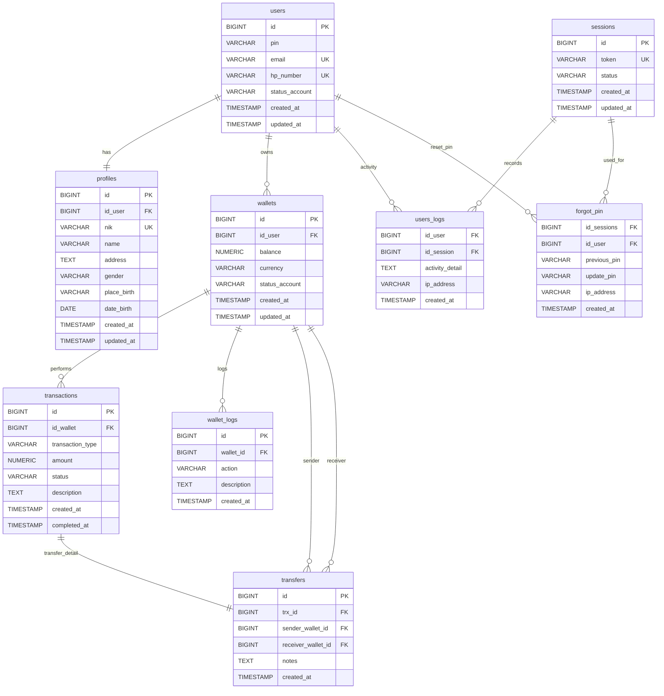
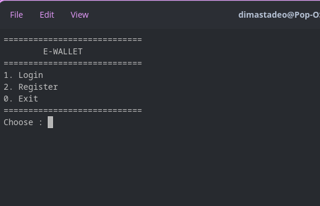
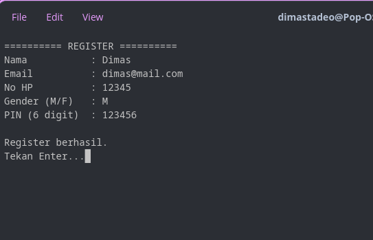
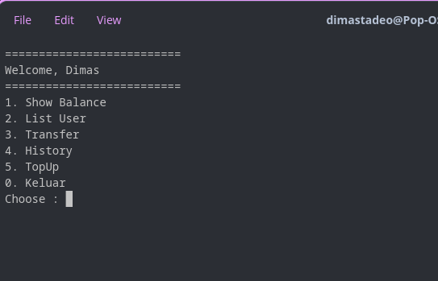
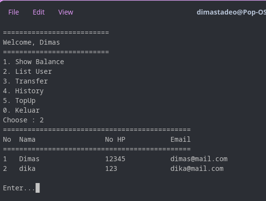
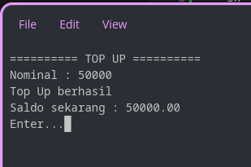
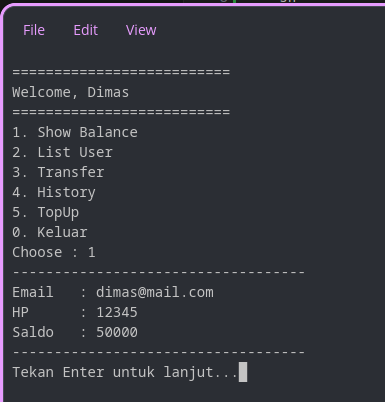
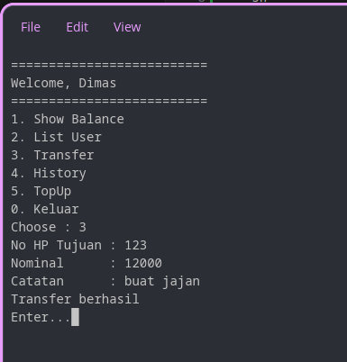
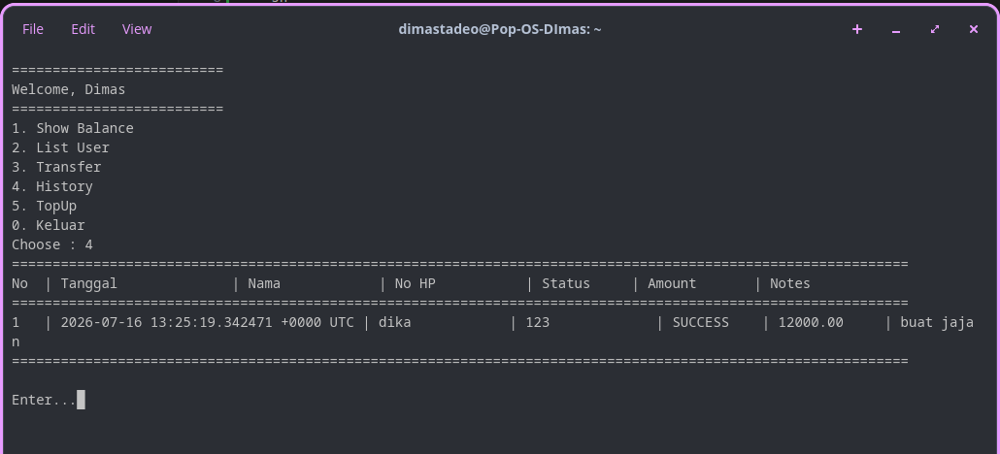

# ERD Aplikasi Ewallet

## Berikut merupakan ERD dan cara run aplikasi Ewallet

### Akses Aplikasi
Untuk menjalankan aplikasi bisa pull dari package dan coba jalankan dengan -it supaya aplikasi berjalan di terminal

```sh
docker pull ghcr.io/dimastadeoo/koda-b8-ewallet:latest
docker run -it ghcr.io/dimastadeoo/koda-b8-ewallet:latest
```




### Screenshot

<table>
    <tr>
        <td>Tampilan Awal Login / Register</td>
        <td>Register Users</td>
        <td>Dashboard Aplikasi Setelah login</td>
    </tr>
    <tr>
        <td></td>
        <td></td>
        <td></td>
    </tr>
</table>

<table>
    <tr>
        <td>List User</td>
        <td>Topup Saldo</td>
        <td>Tampilkan Saldo</td>
    </tr>
    <tr>
        <td></td>
        <td></td>
        <td></td>
    </tr>
</table>

<table>
    <tr>
        <td>Process Transfer</td>
        <td>Topup Saldo</td>
    </tr>
    <tr>
        <td></td>
        <td></td>
    </tr>
</table>