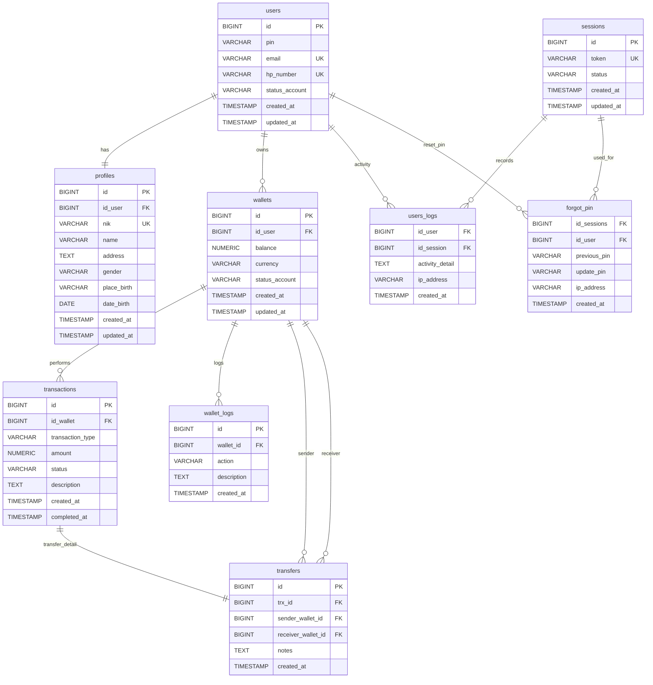

# ERD Aplikasi Ewallet

## Berikut merupakan ERD dan cara run aplikasi Ewallet

```mermaid
erDiagram
    users {
        BIGINT id PK
        VARCHAR pin
        VARCHAR email UK
        VARCHAR hp_number UK
        VARCHAR status_account
        TIMESTAMP created_at
        TIMESTAMP updated_at
    }

    profiles {
        BIGINT id PK
        BIGINT id_user FK
        VARCHAR nik UK
        VARCHAR name
        TEXT address
        VARCHAR gender
        VARCHAR place_birth
        DATE date_birth
        TIMESTAMP created_at
        TIMESTAMP updated_at
    }

    sessions {
        BIGINT id PK
        VARCHAR token UK
        VARCHAR status
        TIMESTAMP created_at
        TIMESTAMP updated_at
    }

    users_logs {
        BIGINT id_user FK
        BIGINT id_session FK
        TEXT activity_detail
        VARCHAR ip_address
        TIMESTAMP created_at
    }

    forgot_pin {
        BIGINT id_sessions FK
        BIGINT id_user FK
        VARCHAR previous_pin
        VARCHAR update_pin
        VARCHAR ip_address
        TIMESTAMP created_at
    }

    wallets {
        BIGINT id PK
        BIGINT id_user FK
        NUMERIC balance
        VARCHAR currency
        VARCHAR status_account
        TIMESTAMP created_at
        TIMESTAMP updated_at
    }

    transactions {
        BIGINT id PK
        BIGINT id_wallet FK
        VARCHAR transaction_type
        NUMERIC amount
        VARCHAR status
        TEXT description
        TIMESTAMP created_at
        TIMESTAMP completed_at
    }

    transfers {
        BIGINT id PK
        BIGINT trx_id FK
        BIGINT sender_wallet_id FK
        BIGINT receiver_wallet_id FK
        TEXT notes
        TIMESTAMP created_at
    }

    wallet_logs {
        BIGINT id PK
        BIGINT wallet_id FK
        VARCHAR action
        TEXT description
        TIMESTAMP created_at
    }

    users ||--|| profiles : has
    users ||--o{ wallets : owns
    users ||--o{ users_logs : activity
    users ||--o{ forgot_pin : reset_pin

    sessions ||--o{ users_logs : records
    sessions ||--o{ forgot_pin : used_for

    wallets ||--o{ transactions : performs
    wallets ||--o{ wallet_logs : logs

    transactions ||--|| transfers : transfer_detail

    wallets ||--o{ transfers : sender
    wallets ||--o{ transfers : receiver
```